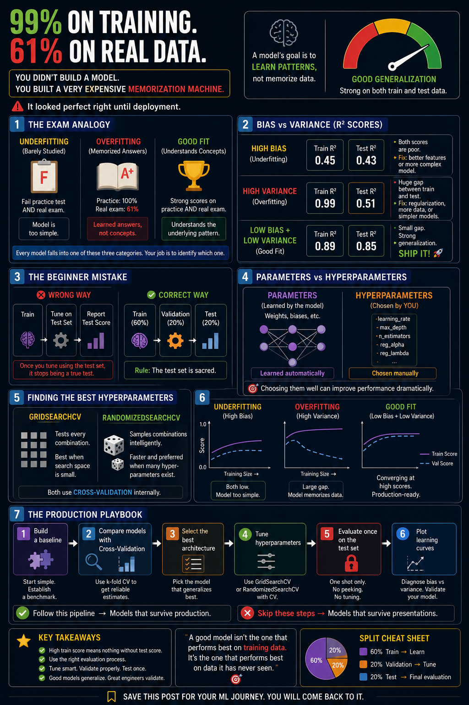

# Model Evaluation & Hyperparameter Tuning



## Overview

Today, I moved beyond simply training machine-learning models and focused on evaluating them honestly, diagnosing their weaknesses, and improving them systematically. I applied these ideas to a house-price regression problem using Ridge Regression, Decision Trees, Random Forest, and XGBoost.

The main goal was to build a model-selection workflow that can generalize to unseen data instead of only performing well on its training set.

## Project Files

- `Model_Evaluation_Hyperparameter_Tuning.ipynb` - complete analysis and code
- `House_Price_prediction.csv` - house-price dataset
- `Day-9.png` - project image
- `README.md` - project documentation and learning summary

## Tools and Libraries

- Python
- NumPy and pandas for data preparation
- Matplotlib for learning and validation curves
- scikit-learn for preprocessing, modeling, evaluation, and tuning
- XGBoost for gradient-boosted regression
- SciPy distributions for randomized hyperparameter sampling

## Work Completed

### 1. Prepared the data

I loaded the house-price dataset and created several features:

- `House_Age` from the year the house was built
- `Total_Rooms` from bedrooms and bathrooms
- `Is_New` to identify houses less than ten years old
- `Area_x_Floors` as an interaction between size and number of floors
- `Condition_enc` as an ordinal encoding of house condition
- One-hot encoded columns for `Location` and `Garage`

I then separated `Price` as the target and split the data into:

| Dataset | Share | Purpose |
|---|---:|---|
| Training | 60% | Fit model parameters |
| Validation | 20% | Compare models and tune hyperparameters |
| Test | 20% | Perform one final, unbiased evaluation |

`StandardScaler` was fitted only on the training data and then applied to the validation and test data. This prevents information from the unseen sets leaking into training.

### 2. Diagnosed underfitting and overfitting

I compared four regression models:

- Ridge Regression as a simple baseline
- An unrestricted Decision Tree
- A pruned Decision Tree with `max_depth=5`
- A Random Forest with 100 trees

For every model, I calculated training R², validation R², and the gap between them. A large train–validation gap indicates overfitting, while low scores on both sets suggest underfitting.

The comparison demonstrated that a full Decision Tree can memorize its training data, while pruning and ensemble methods can improve generalization.

### 3. Created learning curves

I used five-fold cross-validation to plot training and validation R² as the training-set size increased. I compared an unrestricted Decision Tree with a Random Forest.

Learning curves helped me recognize three patterns:

- Both scores low and close: underfitting
- Training score high but validation score much lower: overfitting
- Both scores high and converging: good generalization

### 4. Tuned XGBoost with GridSearchCV

I exhaustively tested combinations of:

- `n_estimators`: 100 and 200
- `max_depth`: 4 and 6
- `learning_rate`: 0.05 and 0.10

This produced 8 combinations. With five-fold cross-validation, it required 40 model fits. I stored both training and validation results so I could compare performance and variability across configurations.

### 5. Explored a larger space with RandomizedSearchCV

I expanded the search to include:

- Number of estimators
- Tree depth
- Learning rate
- Row subsampling
- Column subsampling
- L1 regularization (`reg_alpha`)
- L2 regularization (`reg_lambda`)

Instead of testing every possible combination, `RandomizedSearchCV` sampled 50 configurations and evaluated each with five-fold cross-validation. This allowed me to search a much larger space efficiently.

### 6. Performed final evaluation

I selected the best estimator from the randomized search and evaluated it on the untouched test set using:

- **R²**, which measures the proportion of target variance explained by the model
- **RMSE**, which measures the typical prediction error in the same units as house price

The notebook also compares the progression from a Ridge baseline to Random Forest, default XGBoost, and tuned XGBoost. The exact final score is generated when the notebook is run because it depends on the completed tuning process.

### 7. Built a validation curve

I varied the Random Forest's `max_depth` from 2 to 20 and plotted its mean training and validation R². This made it possible to identify the depth where validation performance peaks before additional complexity begins to increase overfitting.

## What I Learned

### Overfitting and underfitting

Underfitting happens when a model is too simple to capture the important patterns. It performs poorly on both training and unseen data. Overfitting happens when a model learns noise or memorizes examples, producing a high training score but a much lower validation score.

### Bias–variance tradeoff

- High bias usually means the model is too simple and underfits.
- High variance usually means the model is too sensitive to its training data and overfits.
- The objective is to find enough complexity to learn the signal without memorizing noise.

### Honest evaluation

The validation set is used for decisions such as model selection and hyperparameter tuning. The test set must remain untouched until the end. Repeatedly checking the test score while tuning would leak information and make the reported performance overly optimistic.

### Parameters versus hyperparameters

Parameters, such as model weights, are learned during training. Hyperparameters, such as learning rate, tree depth, and number of estimators, are chosen before training and control how the learning process behaves.

### Grid search versus randomized search

Grid search is useful for a small number of discrete choices because it evaluates every combination. Randomized search is more practical for large or continuous spaces because it can explore more varied configurations within a fixed computation budget.

### A reusable model-selection workflow

1. Establish a simple baseline.
2. Compare several model families with cross-validation.
3. Select a promising model architecture.
4. Tune its hyperparameters without using the test set.
5. Evaluate the selected model once on the test set.
6. Inspect learning and validation curves to confirm its behavior.

## How to Run the Project

1. Keep the notebook and `House_Price_prediction.csv` in the same directory.
2. Install the required packages:

   ```bash
   pip install numpy pandas matplotlib scikit-learn scipy xgboost jupyter
   ```

3. Open `Model_Evaluation_Hyperparameter_Tuning.ipynb` in Jupyter Notebook or JupyterLab.
4. Run the cells in order from top to bottom.

## Knowledge Check

1. A model has a training R² of 0.97 and a test R² of 0.65. What is happening, and how can it be improved?
2. Why should the test set be evaluated only once at the end?
3. When should RandomizedSearchCV be preferred over GridSearchCV?
4. What do learning curves look like when a model is underfitting?
5. What is the difference between a parameter and a hyperparameter?


<details>
<summary><strong>Answer key</strong></summary>

   
1. The large gap indicates overfitting, or high variance. Possible improvements include reducing model complexity, adding regularization, collecting more training data, pruning a tree, or using cross-validation to choose safer hyperparameters.
2. The test set represents completely unseen data. If its results influence model selection or tuning, information from the test set leaks into the development process and the final score is no longer an unbiased estimate of real-world performance.
3. RandomizedSearchCV is preferable when there are many hyperparameters, broad ranges, or continuous distributions. It explores a larger and more diverse search space with a fixed number of trials, whereas an exhaustive grid can become computationally expensive.
4. The training and validation scores are both low and usually close together, even as more training examples are added. This suggests that the model needs better features, less regularization, or greater complexity.
5. A parameter is learned by the model from the training data, such as a coefficient or tree split. A hyperparameter is selected before training, such as `max_depth`, `learning_rate`, or `n_estimators`, and controls the model or training process.

</details>


## Key Takeaway

A strong training score does not automatically mean a strong model. Reliable machine learning requires a baseline, clean data splits, cross-validation, systematic tuning, diagnostic curves, and one final evaluation on genuinely unseen data.
